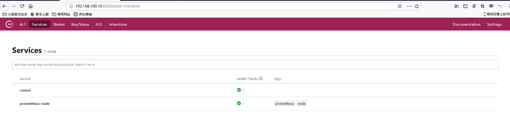
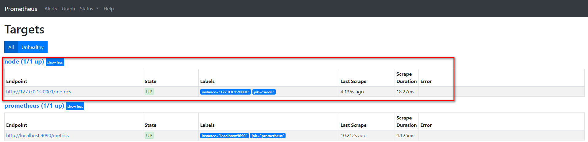

https://www.yuque.com/ssebank/eoudn8/et1ulc

https://www.cnblogs.com/zhaojiedi1992/p/zhaojiedi_liunx_60_prometheus_config.html


# 1 总览 

- global： 此片段指定的是prometheus的全局配置， 比如采集间隔，抓取超时时间等。
- rule_files： 此片段指定报警规则文件， prometheus根据这些规则信息，会推送报警信息到alertmanager中。
- scrape_configs: 此片段指定抓取配置，prometheus的数据采集通过此片段配置。
- alerting: 此片段指定报警配置， 这里主要是指定prometheus将报警规则推送到指定的alertmanager实例地址。
- remote_write: 指定后端的存储的写入api地址。
- remote_read: 指定后端的存储的读取api地址


```yaml
# 全局配置段
global:
  # 采集间隔 
  scrape_interval:     15s # Set the scrape interval to every 15 seconds. Default is every 1 minute.
  # 计算报警和预聚合间隔
  evaluation_interval: 15s # Evaluate rules every 15 seconds. The default is every 1 minute.
  # 采集超时时间
  scrape_timeout: 10s 
  # 查询日志，包含各阶段耗时统计
  query_log_file: /opt/logs/prometheus_query_log
  # 全局标签组
  # 通过本实例采集的数据都会叠加下面的标签
  external_labels:
    account: 'huawei-main'
    region: 'beijng-01'


# Alertmanager信息段
alerting:
  alertmanagers:
  - scheme: http
    static_configs:
    - targets:
      - "localhost:9093"

# 告警、预聚合配置文件段
rule_files:
    - /etc/prometheus/rules/record.yml
    - /etc/prometheus/rules/alert.yml

# 采集配置段
scrape_configs:
  # The job name is added as a label `job=<job_name>` to any timeseries scraped from this config.
  - job_name: 'prometheus'

    # metrics_path defaults to '/metrics'
    # scheme defaults to 'http'.

    static_configs:
    - targets: ['localhost:9090']

# 远程查询段
remote_read:
  # prometheus 
  - url: http://prometheus/v1/read
    read_recent: true

  # m3db 
  - url: "http://m3coordinator-read:7201/api/v1/prom/remote/read"
    read_recent: true

# 远程写入段
remote_write:
  - url: "http://m3coordinator-write:7201/api/v1/prom/remote/write"
    queue_config:
      capacity: 10000
      max_samples_per_send: 60000
    write_relabel_configs:
      - source_labels: [__name__]
        separator: ;
        # 标签key前缀匹配到的drop
        regex: '(kubelet_|apiserver_|container_fs_).*'
        replacement: $1
        action: drop
    
```


```yaml
# my global config
global:
  scrape_interval:     15s # Set the scrape interval to every 15 seconds. Default is every 1 minute.
  evaluation_interval: 15s # Evaluate rules every 15 seconds. The default is every 1 minute.
  # scrape_timeout is set to the global default (10s).

# Alertmanager configuration
alerting:
  alertmanagers:
  - static_configs:
    - targets:
       - alertmanager:9093

# Load rules once and periodically evaluate them according to the global 'evaluation_interval'.
rule_files:
  # - "first_rules.yml"
  # - "second_rules.yml"

# A scrape configuration containing exactly one endpoint to scrape:
# Here it's Prometheus itself.
scrape_configs:
  # The job name is added as a label `job=<job_name>` to any timeseries scraped from this config.
  - job_name: 'prometheus'

    # metrics_path defaults to '/metrics'
    # scheme defaults to 'http'.

    static_configs:
    - targets: ['192.168.8.181:9090']
 
```


# 2 global片段主要参数

```
  # How frequently to scrape targets by default.
  [ scrape_interval: <duration> | default = 1m ]      # 抓取间隔

  # How long until a scrape request times out.
  [ scrape_timeout: <duration> | default = 10s ]     # 抓取超时时间

  # How frequently to evaluate rules.
  [ evaluation_interval: <duration> | default = 1m ]   # 评估规则间隔

  # The labels to add to any time series or alerts when communicating with
  # external systems (federation, remote storage, Alertmanager).
  external_labels:                                                  # 外部一些标签设置
    [ <labelname>: <labelvalue> ... ]
```


# 3 scrapy_config片段主要参数

```
一个scrape_config 片段指定一组目标和参数， 目标就是实例，指定采集的端点， 参数描述如何采集这些实例， 主要参数如下

- scrape_interval: 抓取间隔,默认继承global值。
- scrape_timeout: 抓取超时时间,默认继承global值。
- metric_path: 抓取路径， 默认是/metrics
- scheme: 指定采集使用的协议，http或者https。
- params: 指定url参数。
- basic_auth: 指定认证信息。
- *_sd_configs: 指定服务发现配置
- static_configs: 静态指定服务job。
- relabel_config: relabel设置。
```


## 3.1 static_configs样例

```
scrape_configs:
  # The job name is added as a label `job=<job_name>` to any timeseries scraped from this config.
  - job_name: 'prometheus'

    # metrics_path defaults to '/metrics'
    # scheme defaults to 'http'.

    static_configs:
    - targets: ['localhost:9090']
  - job_name: "node"
    static_configs:
    - targets:
      - "192.168.100.10:20001"      - "192.168.100.11:20001  
      - "192.168.100.12:20001"
```

## 3.2 file_sd_configs样例
通过file_fd_files 配置后我们可以在不重启prometheus的前提下， 修改对应的采集文件（node_dis.yml）， 在特定的时间内（refresh_interval），prometheus会完成配置信息的载入工作。

```
scrape_configs:
  # The job name is added as a label `job=<job_name>` to any timeseries scraped from this config.
  - job_name: 'prometheus'

    # metrics_path defaults to '/metrics'
    # scheme defaults to 'http'.

    static_configs:
    - targets: ['localhost:9090']
  - job_name: "node"
    file_sd_configs:
    - refresh_interval: 1m
      files: 
      - "/usr/local/prometheus/prometheus/conf/node*.yml"

# 独立文件配置如下
cat conf/node-dis.conf
- targets: 
  - "192.168.100.10:20001"
  - "192.168.100.11:20001"
  - "192.168.100.12:20001"
    
或者可以这样配置
[root@node00 conf]# cat node-dis.yml 
- targets: 
  - "192.168.100.10:20001"
  labels: 
    hostname: node00
- targets: 
  - "192.168.100.11:20001"
  labels: 
    hostname: node01
- targets: 
  - "192.168.100.12:20001"
  labels: 
    hostname: node02
```


## 3.3 consul_sd_file样例

由于consul的配置需要有consul的服务提供， 这里简单部署下consul的服务。

```
# 进入下载目录[root@node00 prometheus]# cd /usr/src/# 下载
[root@node00 src]# wget https://releases.hashicorp.com/consul/1.6.1/consul_1.6.1_linux_amd64.zip# 解压
[root@node00 src]# unzip consul_1.6.1_linux_amd64.zip  
Archive:  consul_1.6.1_linux_amd64.zip
  inflating: consul     # 查看             
[root@node00 src]# ls
consul  consul_1.6.1_linux_amd64.zip  debug  kernels  node_exporter-0.18.1.linux-amd64.tar.gz  prometheus-2.12.0.linux-amd64.tar.gz# 查看文件类型
[root@node00 src]# file consul
consul: ELF 64-bit LSB executable, x86-64, version 1 (SYSV), statically linked, not stripped# 防止到系统bin目录
[root@node00 src]# mv consul /usr/local/bin/# 确保环境变量包含
[root@node00 src]# echo $PATH
/usr/local/sbin:/usr/local/bin:/usr/sbin:/usr/bin:/root/bin
# 运行测试
[root@node00 consul.d]# consul agent -dev# 测试获取成员[root@node00 ~]# consul members
# 创建配置目录 
[root@node00 ~]#mkdir /etc/consul.d
[root@node00 consul.d]# cat prometheus-node.json 
{  "addresses": {                        "http": "0.0.0.0",                        "https": "0.0.0.0"           },  "services": [{                "name": "prometheus-node",                "tags": ["prometheus","node"],                "port": 20001             }]  }# 指定配置文件运行consul  agent -dev -config-dir=/etc/consul.d
```

打开web管理界面 192.169.100.10:8500，查看相应的服务信息。


上面我们可以看到有2个service ， 其中prometheus-node是我们定义的service。


和prometheus集成样例：
```
scrape_configs:  
  # The job name is added as a label `job=<job_name>` to any timeseries scraped from this config.  
  - job_name: 'prometheus'  
  
    # metrics_path defaults to '/metrics'  
    # scheme defaults to 'http'.  
    static_configs:  
    - targets: ['localhost:9090']  
  
  - job_name: "node"  
    consul_sd_configs:  
    - server: localhost:8500  
      services:   
      - prometheus-node  
    #  tags:   
    #  - prometheus  
    #  - node  
    #- refresh_interval: 1m
```


在prometheus的target界面上我们看到服务注册发现的结果。



我们通过api接口给该service添加一个节点， 看看是否可以同步过来。

```
[root@node00 ~]# curl -XPUT -d@node01.json  127.0.0.1:8500/v1/catalog/register  
true  
[root@node00 ~]# cat node01.json   
{  
        "id":"0cc931ea-9a3a-a6ff-3ef5-e0c99371d77d",  
        "Node": "node01",  
        "Address": "192.168.100.11",  
        "Service":  
                {  
                        "Port": 20001,  
                        "ID": "prometheus-node",  
                        "Service": "prometheus-node"  
                }  
}
```


在consul和prometheus中查看


 

可以发现通过向consul中特定服务加入节点， 就可以在prometheus动态变动采集的实例地址。


# 4 例子: 准备prometheus配置文件，配置采集两个node_exporter


```yaml

global:
  scrape_interval: 15s
  scrape_timeout: 10s
  evaluation_interval: 15s
alerting:
  alertmanagers:
  - scheme: http
    timeout: 10s
    api_version: v1
    static_configs:
    - targets: []
scrape_configs:
- job_name: prometheus
  honor_timestamps: true
  scrape_interval: 15s
  scrape_timeout: 10s
  metrics_path: /metrics
  scheme: http
  static_configs:
  - targets:
    - localhost:9090
- job_name: node_exporter
  honor_timestamps: true
  scrape_interval: 15s
  scrape_timeout: 10s
  metrics_path: /metrics
  scheme: http
  static_configs:
  - targets:
    - 172.16.58.79:9100
    - 172.16.58.78:9100


```


热更新配置
命令行开启  --web.enable-lifecycle
curl -X POST http://localhost:9090/-/reload 

页面查看targets up情况


