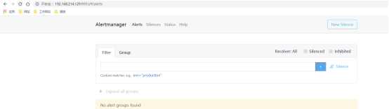

Alertmanager和Prometheus Server一样均采用Golang实现，并且没有第三方依赖。一般来说我们可以通过以下几种方式来部署Alertmanager：二进制包、容器以及源码方式安装。


# 1 使用二进制包部署AlertManager


## 1.1 **获取并安装软件包**

Alertmanager最新版本的下载地址可以从Prometheus官方网站[https://prometheus.io/download/](https://prometheus.io/download/)获取。
```
export VERSION=0.15.2
curl -LO https://github.com/prometheus/alertmanager/releases/download/v$VERSION/alertmanager-$VERSION.darwin-amd64.tar.gz
tar xvf alertmanager-$VERSION.darwin-amd64.tar.gz
```

然后移动到/opt/prometheus文件夹里面，没有该文件夹则创建


## 1.2 **创建alertmanager配置文件**

Alertmanager解压后会包含一个默认的alertmanager.yml配置文件，内容如下所示：

```
global:
  resolve_timeout: 5m

route:
  group_by: ['alertname']
  group_wait: 10s
  group_interval: 10s
  repeat_interval: 1h
  receiver: 'web.hook'
receivers:
- name: 'web.hook'
  webhook_configs:
  - url: 'http://127.0.0.1:5001/'
inhibit_rules:
  - source_match:
      severity: 'critical'
    target_match:
      severity: 'warning'
    equal: ['alertname', 'dev', 'instance']
```

Alertmanager的配置主要包含两个部分：路由(route)以及接收器(receivers)。所有的告警信息都会从配置中的顶级路由(route)进入路由树，根据路由规则将告警信息发送给相应的接收器。

在Alertmanager中可以定义一组接收器，比如可以按照角色(比如系统运维，数据库管理员)来划分多个接收器。接收器可以关联邮件，Slack以及其它方式接收告警信息。

当前配置文件中定义了一个默认的接收者default-receiver由于这里没有设置接收方式，目前只相当于一个占位符。关于接收器的详细介绍会在后续章节介绍。

在配置文件中使用route定义了顶级的路由，路由是一个基于标签匹配规则的树状结构。所有的告警信息从顶级路由开始，根据标签匹配规则进入到不同的子路由，并且根据子路由设置的接收器发送告警。目前配置文件中只设置了一个顶级路由route并且定义的接收器为default-receiver。因此，所有的告警都会发送给default-receiver。关于路由的详细内容会在后续进行详细介绍。


## 1.3 **启动Alertmanager**

Alermanager会将数据保存到本地中，默认的存储路径为`data/`。因此，在启动Alertmanager之前需要创建相应的目录：
```
./alertmanager
```

用户也在启动Alertmanager时使用参数修改相关配置。`--config.file`用于指定alertmanager配置文件路径，`--storage.path`用于指定数据存储路径。

----


root用户下启动

输入:
nohup ./alertmanager   >/dev/null   2>&1 &

启动成功之后，在浏览器上输入 ip+9093可以查看相关信息


## 1.4 **查看运行状态**

Alertmanager启动后可以通过9093端口访问，[http://192.168.33.10:9093](http://192.168.33.10:9093)




Alert菜单下可以查看Alertmanager接收到的告警内容。Silences菜单下则可以通过UI创建静默规则，这部分我们会在后续部分介绍。进入Status菜单，可以看到当前系统的运行状态以及配置信息。


## 1.5 开机自启动

```shell
# 进入下载目录  
[root@node00 ~]# cd /usr/src/  
# 下载alertmanager  
[root@node00 src]# wget https://github.com/prometheus/alertmanager/releases/download/v0.19.0/alertmanager-0.19.0.linux-amd64.tar.gz  
# 解压  
[root@node00 src]# tar xf alertmanager-0.19.0.linux-amd64.tar.gz 
[root@node00 src]# ll
total 126440
drwxr-xr-x  2 3434 3434       93 Sep  3 11:39 alertmanager-0.19.0.linux-amd64
-rw-r--r--  1 root root 24201990 Sep  3 11:39 alertmanager-0.19.0.linux-amd64.tar.gz
-rw-r--r--  1 root root     6930 Sep 25 04:33 a.txt
-rw-r--r--  1 root root 39965581 Sep 24 20:53 consul_1.6.1_linux_amd64.zip
-rw-r--r--  1 root root  4077560 Sep 10 20:20 consul-template_0.22.0_linux_amd64.tgz
drwxr-xr-x. 2 root root        6 Nov  5  2016 debug
drwxr-xr-x. 2 root root        6 Nov  5  2016 kernels
-rw-r--r--  1 root root  8083296 Sep 20 21:08 node_exporter-0.18.1.linux-amd64.tar.gz
-rw-r--r--  1 root root 53127635 Sep 20 05:05 prometheus-2.12.0.linux-amd64.tar.gz  
  
# 部署到特定位置
[root@node00 src]# mv alertmanager-0.19.0.linux-amd64 /usr/local/prometheus/
[root@node00 src]# cd /usr/local/prometheus/
# 查看目录情况
[root@node00 prometheus]# ll
total 4
drwxr-xr-x 2       3434       3434   93 Sep  3 11:39 alertmanager-0.19.0.linux-amd64
lrwxrwxrwx 1 prometheus prometheus   29 Sep 20 05:06 prometheus -> prometheus-2.12.0.linux-amd64
drwxr-xr-x 6 prometheus prometheus 4096 Sep 26 06:01 prometheus-2.12.0.linux-amd64  
# 创建软连接
[root@node00 prometheus]# ln -s alertmanager-0.19.0.linux-amd64 alertmanager  
# 确认软连接
[root@node00 prometheus]# ll
total 4
lrwxrwxrwx 1 root       root         31 Sep 27 03:12 alertmanager -> alertmanager-0.19.0.linux-amd64
drwxr-xr-x 2       3434       3434   93 Sep  3 11:39 alertmanager-0.19.0.linux-amd64
lrwxrwxrwx 1 prometheus prometheus   29 Sep 20 05:06 prometheus -> prometheus-2.12.0.linux-amd64
drwxr-xr-x 6 prometheus prometheus 4096 Sep 26 06:01 prometheus-2.12.0.linux-amd64
# 准备开机自启配置文件
[root@node00 alertmanager]# cd /usr/lib/systemd/system/
[root@node00 system]# cat alertmanager.service 
[Unit]
Description=alertmanager
After=network.target 

[Service]
User=prometheus
Group=prometheus
WorkingDirectory=/usr/local/prometheus/alertmanager
ExecStart=/usr/local/prometheus/alertmanager/alertmanager  --log.level=debug --log.format=json  

# ExecStart=/usr/local/prometheus/alertmanager/alertmanager  

[Install] WantedBy=multi-user.target   
  
# 修改权限  
[root@node00 alertmanager]# chown prometheus:prometheus /usr/local/prometheus/alertmanager -R  
# 启动
[root@node00 alertmanager]# systemctl restart alertmanager  
# 查看状态
[root@node00 alertmanager]# systemctl status alertmanager  
# 开机自启
[root@node00 system]# systemctl enable alertmanager
```


# 2 DockerCompose 方式

https://hty1024.com/archives/prometheus-jian-kong-fang-an-xue-xi-bi-ji--san-grafana-de-an-zhuang-he-pei-zhi


1 目录准备
```
mkdir -pv /apps/alertmanager/{conf,template}
```

2 编辑 docker-compose.yml 文件
```
vim /apps/alertmanager/docker-compose.yml
```

```
version: "3"
	services:
	  alertmanager:
	    image: prom/alertmanager:v0.24.0
	    container_name: prometheus-alertmanager
	    hostname: alertmanager
	    restart: always
	    volumes:
	      - /apps/alertmanager/template:/etc/alertmanager/template
	      - /apps/alertmanager/conf/alertmanager.yml:/etc/alertmanager/alertmanager.yml
	    ports:
	      - 9093:9093
	networks:
	  default:
	    external:
	      name: prometheus
```


3 编辑 alertmanager.yml 文件
```
vim /apps/alertmanager/conf/alertmanager.yml
```

```
global:
	  resolve_timeout: 5m
	 
	route:
	  group_by: ['instance']
	  group_wait: 30s
	  group_interval: 30s
	  repeat_interval: 1h
	  receiver: 'dingtalk' 
	  routes:
	  - receiver: 'message'
	    continue: true
	    match:
	      severity: emergency
	  - receiver: 'dingtalk'
	    continue: true
	    match_re:
	      severity: critical|warning
	 
	receivers: 
	- name: 'dingtalk'
	  webhook_configs:
	  - url: 'http://127.0.0.1:9080/prometheusalert?type=dd&tpl=prometheus-dd-my&ddurl=https://oapi.dingtalk.com/robot/send?access_token=xxx'
	- name: 'message'
	  webhook_configs:
	  - url: 'http://127.0.0.1:9080/prometheusalert?type=txdx&tpl=prometheus-dx-my&phone=xxx'
	 
	inhibit_rules:
	  - source_match:
	      severity: 'critical'
	    target_match:
	      severity: 'warning'
	    equal: ['instance']
```

说明：

- 配置文件中 `receivers` 配置实际的告警发送方式，此处使用了开源组件 `Prometheus Alert` 具体配置请参考官方文档
- `Alertmanager` 官方文档：[https://prometheus.io/docs/alerting/latest/alertmanager](https://prometheus.io/docs/alerting/latest/alertmanager)
- `Prometheus Alert` 官方文档：[https://feiyu563.gitbook.io/prometheusalert](https://feiyu563.gitbook.io/prometheusalert)
- `Alertmanager` 配置文件官方说明：[https://prometheus.io/docs/alerting/latest/configuration](https://prometheus.io/docs/alerting/latest/configuration)
- `Alertmanager` 配置文件详解：[https://www.cnblogs.com/kebibuluan/p/14928490.html](https://www.cnblogs.com/kebibuluan/p/14928490.html)


4 创建 docker 网段 prometheus
检查是否存在 prometheus 网段：

```
docker network list
```

若不存在，则创建：
```
docker network create prometheus --subnet 10.21.22.0/24
```


5 启动 Alertmanager 容器
```
cd /apps/alertmanager
docker-compose up -d
```


6 查看 Alertmanager 容器状态、查看  Alertmanager 容器日志
```
cd /apps/alertmanager
docker-compose ps
docker-compose logs -f
```


7 编辑 Prometheus Server 的 prometheus.yml 文件
编辑 Prometheus 的 prometheus.yml 文件，在顶层结构中添加如下内容：
```
alerting:
	  alertmanagers:
	  - static_configs:
	    - targets: ['localhost:9093']
```

8 
重启 Prometheus Server
重启 Prometheus Server 服务


# 3 关联Prometheus与Alertmanager

在Prometheus的架构中被划分成两个独立的部分。Prometheus负责产生告警，而Alertmanager负责告警产生后的后续处理。因此Alertmanager部署完成后，需要在Prometheus中设置Alertmanager相关的信息。

编辑Prometheus配置文件prometheus.yml,并添加以下内容
/usr/local/prometheus/prometheus/prometheus.yml

```
alerting:
  alertmanagers:
    - static_configs:
        - targets: ['localhost:9093']
```

重启Prometheus服务，成功后，可以从[http://192.168.33.10:9090/config](http://192.168.33.10:9090/config)查看alerting配置是否生效。

此时，再次尝试手动拉高系统CPU使用率：

```
cat /dev/zero>/dev/null
```

等待Prometheus告警进行触发状态：


查看Alertmanager UI此时可以看到Alertmanager接收到的告警信息。


接下来

目前为止，我们已经成功安装部署了Alertmanager并且与Prometheus关联，能够正常接收来自Prometheus的告警信息。接下来我们将详细介绍Alertmanager是如何处理这些接收到的告警信息的。


