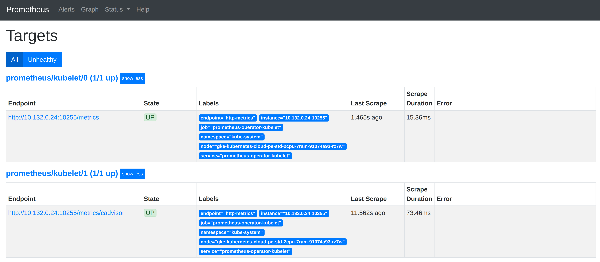

在第1章中，我们已经初步了解了Node Exporter的使用场景和方法。本小节，将会介绍更多常用的Exporter用法。包括如何监控容器运行状态，如何监控和评估MySQL服务的运行状态以及如何通过Prometheus实现基于网络探测的黑盒监控。

CAdvisor是Google开源的一款用于展示和分析容器运行状态的可视化工具。通过在主机上运行CAdvisor用户可以轻松的获取到当前主机上容器的运行统计信息，并以图表的形式向用户展示。

Kubelet is a service that runs on each worker node in a Kubernetes cluster and is resposible for managing the Pods and containers on a machine. cAdvisor is a container resource usage and performance analysis tool, open sourced by Google. For monitoring Kubernetes with Prometheus we care about Kubelet and cAdvisor becuase we can scrape metrics from these services regarding container resource usage.

https://observability.thomasriley.co.uk/monitoring-kubernetes/metrics/kubelet-cadvisor/

# 1 容器监控：cAdvisor

Docker是一个开源的应用容器引擎，让开发者可以打包他们的应用以及依赖包到一个可移植的容器中，然后发布到任何流行的Linux/Windows/Mac机器上。容器镜像正成为一个新的标准化软件交付方式。

例如，可以通过以下命令快速在本地启动一个Nginx服务：

```
docker run -itd nginx
```

为了能够获取到Docker容器的运行状态，用户可以通过Docker的stats命令获取到当前主机上运行容器的统计信息，可以查看容器的CPU利用率、内存使用量、网络IO总量以及磁盘IO总量等信息。

```
$ docker stats
CONTAINER           CPU %               MEM USAGE / LIMIT     MEM %               NET I/O             BLOCK I/O           PIDS
9a1648bec3b2        0.30%               196KiB / 3.855GiB     0.00%               828B / 0B           827kB / 0B          1
```

除了使用命令以外，用户还可以通过Docker提供的HTTP API查看容器详细的监控统计信息。


# 2 安装CAdvisor


## 2.1 用kubenetes去部署

We do not need to deploy a Prometheus Exporter to scrape metrics from Kublet and cAdvisor as they expose metrics endpoints out the box, therefore we only need to configure Prometheus to start scraping metrics using a ServiceMonitor.

Create a file called **kubelet.yaml** and add the following:

```
apiVersion: monitoring.coreos.com/v1
kind: ServiceMonitor
metadata:
  labels:
    app: kubelet
    serviceMonitorSelector: prometheus
  name: kubelet
  namespace: prometheus
spec:
  endpoints:
  - bearerTokenFile: /var/run/secrets/kubernetes.io/serviceaccount/token
    honorLabels: true
    interval: 30s
    port: http-metrics
    scheme: http
    tlsConfig:
      insecureSkipVerify: true
  - bearerTokenFile: /var/run/secrets/kubernetes.io/serviceaccount/token
    honorLabels: true
    interval: 30s
    path: /metrics/cadvisor
    port: http-metrics
    scheme: http
    tlsConfig:
      insecureSkipVerify: true
  jobLabel: kubelet
  namespaceSelector:
    matchNames:
    - kube-system
  selector:
    matchLabels:
      k8s-app: kubelet

```

The ServiceMonitor defined in the YAML above will scrape the **/metrics** and **/metrics/cadvisor** endpoints on Kubelet via the **kubelet** Service in the **kube-system** namespace. It is worth noting, the configuration of Kubelet may differ depending your Kubernetes environment. The example above is tested to work on GCP Kubernetes Engine.

Go ahead and install the ServiceMonitor into your Kubernetes cluster by executing `kubectl apply -f kubelet.yaml`.

After a few moments, you will see two Targets being scraped by Prometheus.

[](https://observability.thomasriley.co.uk/monitoring-kubernetes/metrics/kubelet-cadvisor/images/kubelet.png?classes=shadow&width=55pc)



## 2.2 Docker的方式

CAdvisor是Google开源的一款用于展示和分析容器运行状态的可视化工具。通过在主机上运行CAdvisor用户可以轻松的获取到当前主机上容器的运行统计信息，并以图表的形式向用户展示。

在本地运行CAdvisor也非常简单，直接运行一下命令即可：

```
docker run \
  --volume=/:/rootfs:ro \
  --volume=/var/run:/var/run:rw \
  --volume=/sys:/sys:ro \
  --volume=/var/lib/docker/:/var/lib/docker:ro \
  --publish=8080:8080 \
  --detach=true \
  --name=cadvisor \
  google/cadvisor:latest
```


## 2.3 DockerCompose方式

1
目录准备
创建目录：
```
mkdir -pv /apps/exporter/cadvisor
```

2
编辑 docker-compose.yml 文件
```
vim /apps/exporter/cadvisor/docker-compose.yml

version: "3"
services:
  cadvisor:
    image: zcube/cadvisor:v0.45.0
    container_name: prometheus-cadvisor
    hostname: cadvisor
    restart: always
    privileged: true
    volumes:
      - /:/rootfs:ro
      - /var/run:/var/run:rw
      - /sys:/sys:ro
      - /var/lib/docker/:/var/lib/docker:ro
    ports:
      - 8080:8080
networks:
  default:
    external:
      name: prometheus

```

3
配置 docker 网段 prometheus
```
检查是否存在 prometheus 网段：
docker network list

若不存在，则创建：
docker network create prometheus --subnet 10.21.22.0/24
```

4 
启动 cadvisor 容器
```
cd /apps/exporter/cadvisor
docker-compose up -d
```


5 
检查 cadvisor 容器状态、查看 cadvisor 容器日志
```
cd /apps/exporter/cadvisor
docker-compose ps
docker-compose logs -f

```


# 3 查看数据 

通过访问[http://localhost:8080](http://localhost:8080)可以查看，当前主机上容器的运行状态，如下所示：CAdvisor可视化：CPU总量


CAdvisor是一个简单易用的工具，相比于使用Docker命令行工具，用户不用再登录到服务器中即可以可视化图表的形式查看主机上所有容器的运行状态。

而在多主机的情况下，在所有节点上运行一个CAdvisor再通过各自的UI查看监控信息显然不太方便，同时CAdvisor默认只保存2分钟的监控数据。好消息是CAdvisor已经内置了对Prometheus的支持。访问[http://localhost:8080/metrics](http://localhost:8080/metrics)即可获取到标准的Prometheus监控样本输出:

```
# HELP cadvisor_version_info A metric with a constant '1' value labeled by kernel version, OS version, docker version, cadvisor version & cadvisor revision.
# TYPE cadvisor_version_info gauge
cadvisor_version_info{cadvisorRevision="1e567c2",cadvisorVersion="v0.28.3",dockerVersion="17.09.1-ce",kernelVersion="4.9.49-moby",osVersion="Alpine Linux v3.4"} 1
# HELP container_cpu_load_average_10s Value of container cpu load average over the last 10 seconds.
# TYPE container_cpu_load_average_10s gauge
container_cpu_load_average_10s{container_label_maintainer="",id="/",image="",name=""} 0
container_cpu_load_average_10s{container_label_maintainer="",id="/docker",image="",name=""} 0
container_cpu_load_average_10s{container_label_maintainer="",id="/docker/15535a1e09b3a307b46d90400423d5b262ec84dc55b91ca9e7dd886f4f764ab3",image="busybox",name="lucid_shaw"} 0
container_cpu_load_average_10s{container_label_maintainer="",id="/docker/46750749b97bae47921d49dccdf9011b503e954312b8cffdec6268c249afa2dd",image="google/cadvisor:latest",name="cadvisor"} 0
container_cpu_load_average_10s{container_label_maintainer="NGINX Docker Maintainers <docker-maint@nginx.com>",id="/docker/f51fd4d4f410965d3a0fd7e9f3250218911c1505e12960fb6dd7b889e75fc114",image="nginx",name="confident_brattain"} 0
```

下面表格中列举了一些CAdvisor中获取到的典型监控指标：

|   |   |   |
|---|---|---|
|指标名称|类型|含义|
|container_cpu_load_average_10s|gauge|过去10秒容器CPU的平均负载|
|container_cpu_usage_seconds_total|counter|容器在每个CPU内核上的累积占用时间 (单位：秒)|
|container_cpu_system_seconds_total|counter|System CPU累积占用时间（单位：秒）|
|container_cpu_user_seconds_total|counter|User CPU累积占用时间（单位：秒）|
|container_fs_usage_bytes|gauge|容器中文件系统的使用量(单位：字节)|
|container_fs_limit_bytes|gauge|容器可以使用的文件系统总量(单位：字节)|
|container_fs_reads_bytes_total|counter|容器累积读取数据的总量(单位：字节)|
|container_fs_writes_bytes_total|counter|容器累积写入数据的总量(单位：字节)|
|container_memory_max_usage_bytes|gauge|容器的最大内存使用量（单位：字节）|
|container_memory_usage_bytes|gauge|容器当前的内存使用量（单位：字节|
|container_spec_memory_limit_bytes|gauge|容器的内存使用量限制|
|machine_memory_bytes|gauge|当前主机的内存总量|
|container_network_receive_bytes_total|counter|容器网络累积接收数据总量（单位：字节）|
|container_network_transmit_bytes_total|counter|容器网络累积传输数据总量（单位：字节）|


# 4 配置 CAdvisor与Prometheus集成

修改/etc/prometheus/prometheus.yml，将cAdvisor添加监控数据采集任务目标当中：
```
- job_name: cadvisor
  static_configs:
  - targets:
    - localhost:8080
```


启动Prometheus服务:
```
prometheus --config.file=/etc/prometheus/prometheus.yml --storage.tsdb.path=/data/prometheus
```


以docker-compose的方式重启 Prometheus服务
```
cd /apps/prometheus
docker-compose restart
```


检查 cadvisor 数据是否正常上报
访问 Prometheus WebUI 的 targets 页面，检查 job 状态
启动完成后，可以在Prometheus UI中查看到当前所有的Target状态：


当能够正常采集到cAdvisor的样本数据后，可以通过以下表达式计算容器的CPU使用率：
```
sum(irate(container_cpu_usage_seconds_total{image!=""}[1m])) without (cpu)
```


----

查询容器内存使用量（单位：字节）:
```
container_memory_usage_bytes{image!=""}
```


----

查询容器网络接收量速率（单位：字节/秒）：
```
sum(rate(container_network_receive_bytes_total{image!=""}[1m])) without (interface)
```


---

查询容器网络传输量速率（单位：字节/秒）：
```
sum(rate(container_network_transmit_bytes_total{image!=""}[1m])) without (interface)
```


---


查询容器文件系统读取速率（单位：字节/秒）：

```
sum(rate(container_fs_reads_bytes_total{image!=""}[1m])) without (device)
```


----


查询容器文件系统写入速率（单位：字节/秒）：

```
sum(rate(container_fs_writes_bytes_total{image!=""}[1m])) without (device)
```


# 5 配置 Grafana 看板

登录 Grafana，导入对应的看板即可。
看板获取地址：https://grafana.com/grafana/dashboards/?dataSource=prometheus&search=docker

注意： 看板导入后需要修改数据源的ID

    数据源查看方式： 在 Grafana 中进入 数据源详情 页面，浏览器 URL 的最后一段字符为该数据源的 ID。 如 URL 为 grafana/datasources/edit/6lbJpCb4z 时， 6lbJpCb4z 即为当前数据源的 ID
    数据源替换方式： 编辑看板，查看看板的 JSON 数据，替换 datasource 中的 uid


# 6 注意事项

若启动 cadvisor 时提示 cadvisor Failed to start container manager: inotify_add_watch /sys/fs/cgroup/cpuacct,cpu: nosuchfile，则执行以下命令，重新挂载 /sys/fs/cgroup 

```
mount -o remount,rw '/sys/fs/cgroup'
sudo  ln -s /sys/fs/cgroup/cpu,cpuacct /sys/fs/cgroup/cpuacct,cpu

```


# 7 Useful Metrics

There are many useful metrics exposed by Kubelet for container resource usage.

Lets start by looking at CPU usage metrics:

- `container_cpu_system_seconds_total` - Usage of system CPU time
- `container_cpu_user_seconds_total` - Usage of user CPU time
- `container_cpu_usage_seconds_total` - Total CPU usage time (system + user)

There are a number of metrics available for memory but to best track the actual memory usage of a Pod use the `container_memory_working_set_bytes` metric.

These metrics include the labels **pod_name** and **namespace** to help you identify the resource usage of specifics Pods per Kubernetes Namespace.