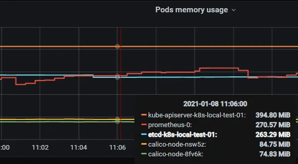
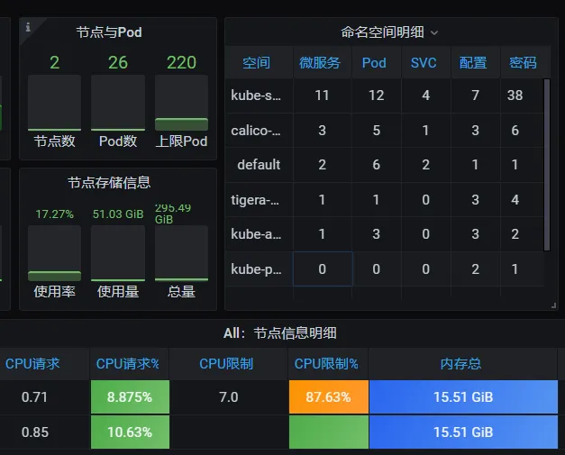
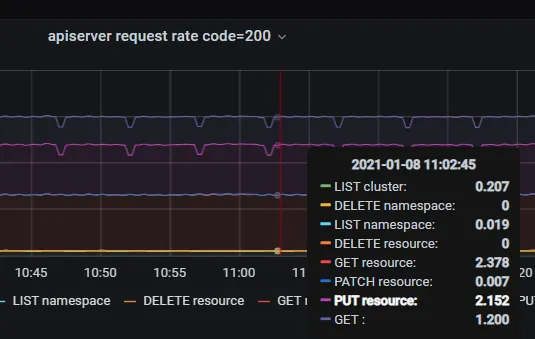

# 1 为什么要做指标分类

- 存储要做分离
- 查询采集等也要分离
- 可用性重要程度做区分： 在线业务指标> 在线中间件指标 > 在线基础资源指标 > 离线业务指标 > 大数据指标

# 2 指标分类

- 基础资源指标 如机器or容器的cpu、mem使⽤率
- 中间件指标 如kafka offset、redis cache情况、mysql 连接数
- 业务研发引⼊sdk埋点指标 如服务延迟、请求qps
- ⼤数据指标 单独分类是autoscaling问题

# 3 k8s中的指标分类

| 指标类型          | 采集源                                                                            | 应用举例                                                                                                                                      | 发现类型                              |
| ------------- | ------------------------------------------------------------------------------ | ----------------------------------------------------------------------------------------------------------------------------------------- | --------------------------------- |
| 容器基础资源指标      | kubelet 内置cadvisor metrics接口                                                   | 查看容器cpu、mem利用率等                                                                                                                           | k8s_sd node级别直接访问node_ip          |
| k8s资源指标       | [kube-stats-metrics](https://github.com/kubernetes/kube-state-metrics) (简称ksm) | 具体可以看[从容器监控kube-stats-metrics看k8s众多组件](https://segmentfault.com/a/1190000023177361) 看pod状态如pod waiting状态的原因 数个数如：查看node pod按namespace分布情况 | 通过coredns访问域名                     |
| k8s服务组件指标     | 服务组件 metrics接口                                                                 | 查看apiserver 、scheduler、etc、coredns请求延迟等                                                                                                   | k8s_sd endpoint级别                 |
| 部署在pod中业务埋点指标 | pod 的metrics接口                                                                 | 依据业务指标场景                                                                                                                                  | k8s_sd pod级别，访问pod ip的metricspath |

容器基础资源指标

k8s资源指标

k8s服务组件指标

