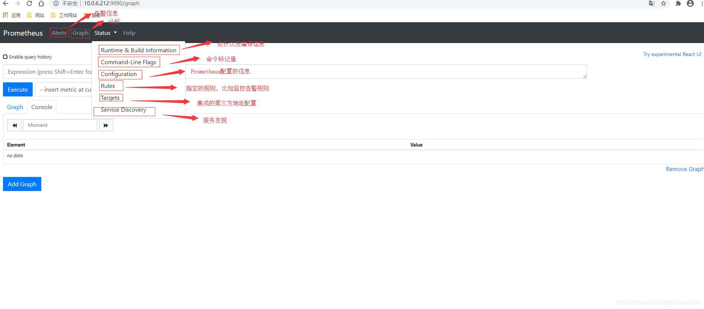

Typically you might use an [Ingress](https://kubernetes.io/docs/concepts/services-networking/ingress/), such as the [Nginx-Ingress](https://github.com/kubernetes/ingress-nginx), for exposing services such as the Prometheus UI to your users outside of a Kubernetes cluster. However, as this guide is not going into the specific details of building a production-ready Kubernetes environment, we will simply use Kubectl port forwarding to access the Prometheus service.

# 1 访问

## 1.1 port-forward 

如果 是 通过 operator 部署的prometheus 那么就可以通过下面的方式 先设置 port forward 

Lets port forward our local environment to the Prometheus instance running in Kubernetes. To do this execute `kubectl port-forward service/prometheus-operated 9090:9090 --namespace prometheus` in your terminal. The **service** called **prometheus-operated** is created by the Operator for accessing the Prometheus instance you created.

If you wish to see Kubernetes Services in the **prometheus** namespace, then execute `kubectl get services --namespace prometheus` in your terminal.

## 1.2 通过端口访问

Prometheus界面地址: ip+9090。
这里我就使用图片加上注释来进行讲解

[http://localhost:9090](http://localhost:9090).

Prometheus UI是Prometheus内置的一个可视化管理界面，通过Prometheus UI用户能够轻松的了解Prometheus当前的配置，监控任务运行状态等。 通过Graph面板，用户还能直接使用PromQL实时查询监控数据。访问ServerIP:9090/graph打开WEB页面，通过PromQL可以查询数据，可以进行基础的数据展示

# 2 基本使用

## 2.1 Prometheus主界面说明

## 2.2 Graph使用示例

## 2.3 查看运行信息

## 2.4 查看命令标记值

## 2.5 查看配置信息

## 2.6 查看集成的组件

集成的组件需要下载对应export服务并启动运行，并且在prometheus的配置中进行添加！

## 2.7 查看服务发现

## 2.8 查看告警规则

first_rules.yml的配置。

## 2.9 查看是否触发告警

**相关文档**:[https://prometheus.io/docs/prometheus/latest/getting_started/](https://prometheus.io/docs/prometheus/latest/getting_started/)