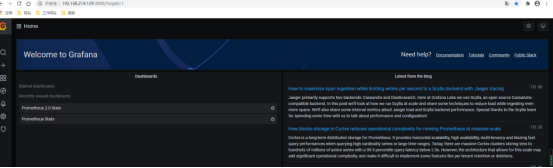

# 1 通过Docker安装 


Grafana是一个开源的可视化平台，并且提供了对Prometheus的完整支持。

```
docker run -d -p 3000:3000 grafana/grafana
```

访问[http://localhost:3000](http://localhost:3000)就可以进入到Grafana的界面中，默认情况下使用账户admin/admin进行登录。在Grafana首页中显示默认的使用向导，包括：安装、添加数据源、创建Dashboard、邀请成员、以及安装应用和插件等主要流程:


# 2 使用 Docker Compose 安装（推荐）
https://hty1024.com/archives/prometheus-jian-kong-fang-an-xue-xi-bi-ji--san-grafana-de-an-zhuang-he-pei-zhi


1
目录准备
创建目录：

```
mkdir -pv /apps/grafana/{conf,data}


```

配置 data 目录权限：
```
chmod -R 777 /apps/grafana/data/
```


2 
编辑 docker-compose.yml 文件

```
vim /apps/grafana/docker-compose.yml
```

```
version: '3'
	services:
	  grafana:
	    image: grafana/grafana:9.1.6
	    container_name: prometheus-grafana
	    restart: always
	    privileged: true
	    ports:
	      - 13000:3000
	    volumes:
	      - /etc/localtime:/etc/localtime:ro
	      - /apps/grafana/conf/grafana.ini:/etc/grafana/grafana.ini
	      - /apps/grafana/data:/var/lib/grafana
	networks:
	  default:
	    external:
	      name: prometheus
```


3 编辑 grafana.ini 文件
```
vim /apps/grafana/conf/grafana.ini
```

grafana.ini 文件模板：https://github.com/grafana/grafana/blob/main/conf/defaults.ini
grafana.ini 文件说明：https://grafana.com/docs/grafana/latest/setup-grafana/configure-grafana


4 创建 docker 网段 prometheus
检查是否已有 prometheus 网段：
```
docker network list
```

没有则创建
```
docker network create prometheus --subnet 10.21.22.0/24
```


5 启动 grafana 容器
```
cd /apps/grafana
docker-compose up -d
```


6 检查 grafana 容器状态、查看 grafana 容器日志
```
cd /apps/grafana
docker-compose ps
docker-compose logs -f


```

7 
访问 Grafana Web UI
访问 Grafana Web UI
默认用户名：admin ，默认密码：admin

# 3 通过二进制文件安装 


- 下载地址：[grafana.com/grafana/dow…](https://link.juejin.cn?target=https%3A%2F%2Fgrafana.com%2Fgrafana%2Fdownload%3Fplatform%3Dwindows "https://grafana.com/grafana/download?platform=windows")
- 下载**grafana-9.0.6.windows-amd64.zip**安装包即可，并解压到**F:\softwarea\grafana\grafana-9.0.6**
- 进入 **bin** 目录，双击**grafana-server.exe**启动
- 启动成功之后，[http://localhost:3000](https://link.juejin.cn?target=http%3A%2F%2Flocalhost%3A3000 "http://localhost:3000")
- 初始登录账户：**admin/admin**

  


1文件准备

将下载下来的grafana-7.1.1-1.x86_64.rpm的文件通过apm方式安装
输入:

 rpm -ivh grafana-7.1.1-1.x86_64.rpm

2 进行安装

如果出现如下错误:
error: Failed dependencies:
urw-fonts is needed by grafana-6.1.4-1.x86_64

一个依赖包没有安装，需要先安装这个依赖包，然后再安装grafana
yum install -y urw-fonts


# 4 grafana 启动

root用户下启动

输入:
sudo /bin/systemctl start grafana-server.service

启动成功之后，在浏览器上输入 ip+3000可以查看相关信息




# 5 登录信息 

Grafana login 界面 登录

Grafanf 界面地址: ip+3000
初始账号密码: admin, admin


username: admin
Password: `prom-operator,  prom$operatpr, admin, ivu$admin `


# 6 Grafana-k8s部署

Grafana提供了很多种部署方式，如果你的展示报警是在K8S集群外，可以二进制直接部署，如果grafana本身在集群内，或者管理端也是k8s集群，可以用yaml部署：


Deployment配置：
```
apiVersion: apps/v1
kind: Deployment
metadata:
  namespace: kube-system
  name: grafana
spec:
  replicas: 1
  selector:
    matchLabels:
      app: grafana
  template:
    metadata:
      namespace: kube-system
      annotations:
        grafana-version: '1.0'
      name: grafana
      labels:
        app: grafana
    spec:
      containers:
      - name: grafana
        image: grafana/grafana:5.1.0
        imagePullPolicy: Always
        securityContext:
          runAsUser: 0
        env: 
        - name: GF_SECURITY_ADMIN_PASSWORD
          value: "admin"
        ports:
        - name: grafana
          containerPort: 3000
        resources:
          requests:
            memory: "100Mi"
            cpu: "100m"
          limits:
            memory: "2048Mi"
            cpu: "1024m"
```


Service配置：
```
apiVersion: v1
kind: Service
metadata:
  namespace: kube-system
  name: grafana
  annotations:
    prometheus.io/scrape: 'true'
  labels:
    name: grafana
spec:
  selector:
    app: grafana
  type: LoadBalancer
  ports:
  - name: grafana
    protocol: TCP
    port: 3000
```


grafana配置文件的字段含义：
```
app_mode：应用名称，默认是production
 
[path]
data：一个grafana用来存储sqlite3、临时文件、回话的地址路径
logs：grafana存储logs的路径
 
[server]
http_addr：监听的ip地址，，默认是0.0.0.0
http_port：监听的端口，默认是3000
protocol：http或者https，，默认是http
domain：这个设置是root_url的一部分，当你通过浏览器访问grafana时的公开的domian名称，默认是localhost
enforce_domain：如果主机的header不匹配domian，则跳转到一个正确的domain上，默认是false
root_url：这是一个web上访问grafana的全路径url，默认是%(protocol)s://%(domain)s:%(http_port)s/
router_logging：是否记录web请求日志，默认是false
cert_file：如果使用https则需要设置
cert_key：如果使用https则需要设置
 
[database]
grafana默认需要使用数据库存储用户和dashboard信息，默认使用sqlite3来存储，你也可以换成其他数据库
type：可以是mysql、postgres、sqlite3，默认是sqlite3
path：只是sqlite3需要，定义sqlite3的存储路径
host：只是mysql、postgres需要，默认是127.0.0.1:3306
name：grafana的数据库名称，默认是grafana
user：连接数据库的用户
password：数据库用户的密码
ssl_mode：只是postgres使用
 
 
[security]
admin_user：grafana默认的admin用户，默认是admin
admin_password：grafana admin的默认密码，默认是admin
login_remember_days：多少天内保持登录状态
secret_key：保持登录状态的签名
disable_gravatar：
 
 
[users]
allow_sign_up：是否允许普通用户登录，如果设置为false，则禁止用户登录，默认是true，则admin可以创建用户，并登录grafana
allow_org_create：如果设置为false，则禁止用户创建新组织，默认是true
auto_assign_org：当设置为true的时候，会自动的把新增用户增加到id为1的组织中，当设置为false的时候，新建用户的时候会新增一个组织
auto_assign_org_role：新建用户附加的规则，默认是Viewer，还可以是Admin、Editor
 
 
[auth.anonymous]
enabled：设置为true，则开启允许匿名访问，默认是false
org_name：为匿名用户设置组织名称
org_role：为匿名用户设置的访问规则，默认是Viewer
 
 
[auth.github]
针对github项目的，很明显，呵呵
enabled = false
allow_sign_up = false
client_id = some_id
client_secret = some_secret
scopes = user:email
auth_url = https://github.com/login/oauth/authorize
token_url = https://github.com/login/oauth/access_token
api_url = https://api.github.com/user
team_ids =
allowed_domains =
allowed_organizations =
 
 
[auth.google]
针对google app的，呵呵
enabled = false
allow_sign_up = false
client_id = some_client_id
client_secret = some_client_secret
scopes = https://www.googleapis.com/auth/userinfo.profile https://www.googleapis.com/auth/userinfo.email
auth_url = https://accounts.google.com/o/oauth2/auth
token_url = https://accounts.google.com/o/oauth2/token
api_url = https://www.googleapis.com/oauth2/v1/userinfo
allowed_domains =
 
 
[auth.basic]
enabled：当设置为true，则http api开启基本认证
 
 
[auth.ldap]
enabled：设置为true则开启LDAP认证，默认是false
config_file：如果开启LDAP，指定LDAP的配置文件/etc/grafana/ldap.toml
 
 
[auth.proxy]
允许你在一个HTTP反向代理上进行认证设置
enabled：默认是false
header_name：默认是X-WEBAUTH-USER
header_property：默认是个名称username
auto_sign_up：默认是true。开启自动注册，如果用户在grafana DB中不存在
 
[analytics]
reporting_enabled：如果设置为true，则会发送匿名使用分析到stats.grafana.org，主要用于跟踪允许实例、版本、dashboard、错误统计。默认是true
google_analytics_ua_id：使用GA进行分析，填写你的GA ID即可
 
 
[dashboards.json]
如果你有一个系统自动产生json格式的dashboard，则可以开启这个特性试试
enabled：默认是false
path：一个全路径用来包含你的json dashboard，默认是/var/lib/grafana/dashboards
 
 
[session]
provider：默认是file，值还可以是memory、mysql、postgres
provider_config：这个值的配置由provider的设置来确定，如果provider是file，则是data/xxxx路径类型，如果provider是mysql，则是user:password@tcp(127.0.0.1:3306)/database_name，如果provider是postgres，则是user=a password=b host=localhost port=5432 dbname=c sslmode=disable
cookie_name：grafana的cookie名称
cookie_secure：如果设置为true，则grafana依赖https，默认是false
session_life_time：session过期时间，默认是86400秒，24小时
 
 
以下是官方文档没有，配置文件中有的
[smtp]
enabled = false
host = localhost:25
user =
password =
cert_file =
key_file =
skip_verify = false
from_address = admin@grafana.localhost
 
[emails]
welcome_email_on_sign_up = false
templates_pattern = emails/*.html
 
 
[log]
mode：可以是console、file，默认是console、file，也可以设置多个，用逗号隔开
buffer_len：channel的buffer长度，默认是10000
level：可以是"Trace", "Debug", "Info", "Warn", "Error", "Critical"，默认是info
 
[log.console]
level：设置级别
 
[log.file]
level：设置级别
log_rotate：是否开启自动轮转
max_lines：单个日志文件的最大行数，默认是1000000
max_lines_shift：单个日志文件的最大大小，默认是28，表示256MB
daily_rotate：每天是否进行日志轮转，默认是true
max_days：日志过期时间，默认是7,7天后删除
```


注意的几个点：

1. 对所有的资源都做request、limit限制，防止耗尽主机资源
2. grafana的一些配置可以通过[变量](https://grafana.com/docs/installation/configuration/)传入：如admin的密码GF_SECURITY_ADMIN_PASSWORD
3. 如果要对grafana的数据进行持久化，建议挂volume或者外部存储，持久化的内容一般都是面板配置。监控面板的配置可以导入导出
4. securityContext：因为版本问题，如果提示grafana的权限不足，可以配置runAsUser: 0
