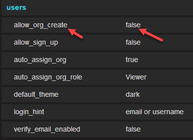

Grafana有账户分权和管理功能，不过和一般的账户分权管理操作不一样。Grafana通过admin账户建立organization，在不通的org内配置数据源和用户，用户隶属于不通的org，只能看到该org内的数据展示。

在org内在进行用户操作权限的配置即可。

Grafana中通过设置不同的组织，以及将用户分配到不同组织，来做到多租户，类似门户的概念。
Grafana默认是不允许非管理员用户创建新的组织的，这个可以通过修改配置文件以允许非管理员用户创建组织：

# 1 新建组织

点击上图中的“New organization”，我们可以看到“多组织常用于多租户部署”，如下所示

输入组织名，点击“Create”，创建完组织后，可以为组织选择不同的用户：

# 2 将用户归入某个 Organisation

 

除此之外，也可以在全局用户 (Global users ) 界面，为用户添加不同的组织：

 

# 3 总结 

经过上面的操作，就将组织和用户进行了划分，然后在每个组织内新建数据源、DashBoard，这样，不同的用户属于不同的组织，不同的组织用于独立的数据源以及DashBoard，就实现了多租户功能。

由于数据源、 DashBoard是和组织关联的，因此没法做到一个组织内不同的用户，看到不同的DashBoard，不过Grafana新建组织，已经可以满足大部分需求了，比如有多个数据中心时，只要建立不同的数据中心组织，配上相应的数据源，就可以使用一套Grafana来展现了。

Grafana后续还会支持文件夹划分及权限控制：

 

