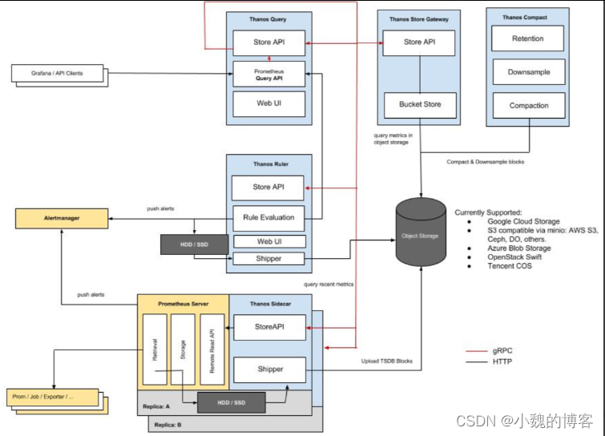
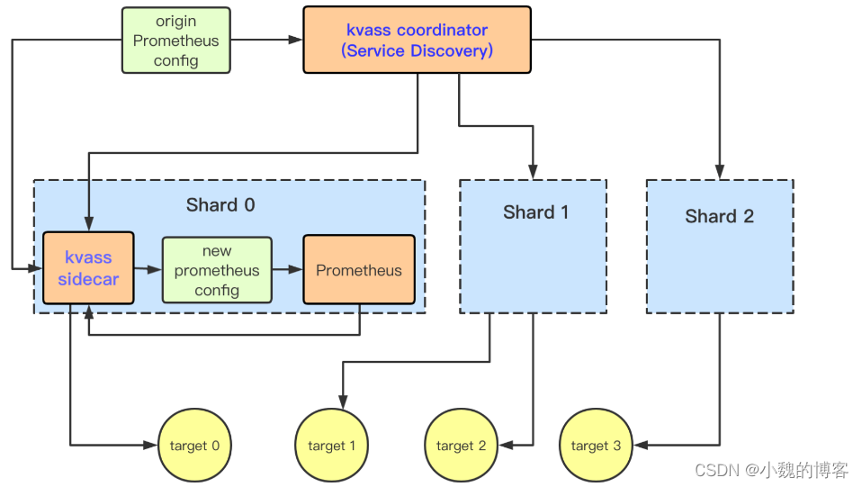

# 1 联邦集群方式

这是promethus官方自带的fan

【URL】 Federation | Prometheus

【原理】 基于prometheus联邦集群方式，部署多个prometheus实例抓取不同分片的监控数据，最后通过全局的prometheus从各分片prometheus上抓取监控数据汇总起来。

promethus自身其实也是个exporter，其它promethus实例可以通过这个exporter进行采集数据。

注意：联邦的方式一般要求只采集自己需要的数据，要不然所有promethus实例的数据汇总到一个promethus实例上，会导致顶部promethus实例性能问题。

【优缺点】  

优点：
    prometheus原生支持，无第三方依赖，部署简单
    可根据业务需求自由分片，配置灵活度高

缺点：
    需要单独维护各分片prometheus配置
    需要人工设计和配置进行各分片Prometheus负载均衡
    全局prometheus不能包含全量数据，只能抓取业务需要汇总的部分数据

# 2 Thanos

【URL】https://github.com/thanos-io/thanos

【原理】Thanos更多关注的是prometheus多副本HA 和 超长期数据存储，但是我们也可以通过它实现横向扩展的prometheus集群，只是将prometheus多副本的配置进行差异化管理（类似联邦方式中的分片prometheus）。

每个promethus实例部署一个sidecar，将promethus数据存储到云存储。
这种使用方式，我们一般不需要在promethus实例上存很久，否则就冗余了。
数据查询的时候，业务其实是查多个thanos的sidecar，然后将数据进行汇总。

【优缺点】 

优点：
    超长期数据存储
    支持全局查询和全局告警
    支持下采样
缺点：
    需要单独维护各分片prometheus配置
    需要人工设计和配置进行各分片Prometheus负载均衡
    依赖对象存储

【架构图】

3、Kvass

kvass为腾讯开源

【URL】https://github.com/tkestack/kvass/blob/master/README_CN.md

【原理】Kvass主要由coordinator和sidecar两个组件组成，coordinator根据prometheus的配置文件进行服务发现，然后将发现到的targets进行分析和评估，计算需要prometheus分片数量并启动对应的prometheus实例，将targets的抓取任务分组下发到不同分片里的sidecar组件，由sidecar负载生成对应分片内的prometheus配置文件。

说白了，初始promethus配置的job很多，kvass会将这些job经过计算平均的拆开，然后部署不同的promethus配置不同的job。

【优缺点】 

优点：
    只需维护一套全局prometheus配置
    根据target实际数据规模来进行分片负载均衡
    自动横向扩容
缺点：
    暂不支持缩容
    全局存储和查询依赖第三方
    target与分片关系不透明
    仅支持static和k8s服务发现

【架构图】

