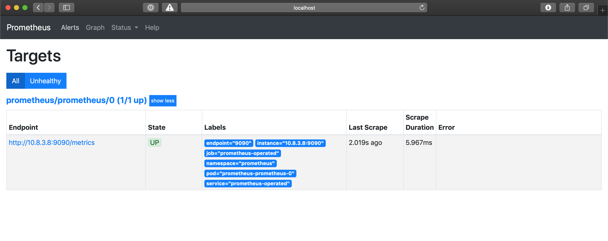

1. 利用Prometheus Operator 声明式 创建一个 Prometheus Server实例
2. 利用Prometheus Operator 声明式 创建一个 ServiceMonitor的对象
3. 关联Promethues与ServiceMonitor
4. 创建 自定义ServiceAccount

> The Prometheus Operator includes a Custom Resource Definition that allows the definition of the ServiceMonitor. The ServiceMonitor is used to define an application you wish to scrape metrics from within Kubernetes, the controller will action the ServiceMonitors we define and automatically build the required Prometheus configuration.

==Within the ServiceMonitor we specify the Kubernetes Labels that the Operator can use to identify the Kubernetes Service which in turn then identifies the Pods, that we wish to monitor. Lets look at how we can use Prometheus to scrape metrics from its own inbuilt metrics endpoint.==


# 1 例子2


## 1.1 确定哪个service我们要去monitor_以及这个service有那些label

Using kubectl describe, we can view the Labels on the prometheus-operated service that the Prometheus Operator previously created. If you wish to see this execute `kubectl describe service prometheus-operated --namespace prometheus `in your terminal or see the example below:

```
$kubectl describe service prometheus-operated --namespace prometheus
Name:              prometheus-operated
Namespace:         prometheus
Labels:            operated-prometheus=true
Annotations:       <none>
Selector:          app=prometheus
Type:              ClusterIP
IP:                None
Port:              web  9090/TCP
TargetPort:        web/TCP
Endpoints:         10.8.3.7:9090
Session Affinity:  None
Events:            <none>

```


## 1.2 创造一个 ServiceMonitor去追踪某个Service 

这个service是贴有某个特定的label的, 
ServiceMonitor中给出要去追踪具有那些label的Service

Now we know this Kubernetes Service has the Label operated-prometheus=true we can create a ServiceMonitor to target this Service. Create a file called servicemonitor.yaml and include the following:

```
apiVersion: monitoring.coreos.com/v1
kind: ServiceMonitor
metadata:
  labels:
    serviceMonitorSelector: prometheus
  name: prometheus
  namespace: prometheus
spec:
  endpoints:
  - interval: 30s
    targetPort: 9090
    path: /metrics
  namespaceSelector:   # 重要
    matchNames:
    - prometheus
  selector:   # 重要 
    matchLabels:
      operated-prometheus: "true"
```


This Kubernetes Resource uses the **monitoring.coreos.com/v1** API Version that was installed into Kubernetes by the Prometheus Operator, as explained previously. It uses the **namespaceSelector** to specify the Kubernetes Namespace in which we wish to locate the Service, in this example above we are selecting within the **prometheus** namespace. It then uses the **selector** to specify that it must match the Label **operated-prometheus** being set as **“true”**.

Under the **endpoints** key we must specify one or more scrape targets for the target service. In this example it will scrape each Pod it selects on TCP port **9090** on the URL **/metrics** every **30 seconds**.

Now apply this YAML to the cluster by executing `kubectl apply -f servicemonitor.yaml`. 


You can then validate this has been created by execute `kubectl get servicemonitor --namespace prometheus`:
```
$kubectl get servicemonitor
NAME                           AGE
prometheus                     1m
```


## 1.3 关联新创造的ServiceMonitor和Prometheus Server

这样 Prometheus Server 才能知道，用户新创造了一个ServiceMonitor , 需要去监控

Before Prometheus Operator will automatically update the running Prometheus instance configuration to set it to scrape metrics from itself, there is one more thing we must do. On the **ServiceMonitor** we defined a label on the resource called **serviceMonitorSelector**, as shown below:

```
metadata:
  labels:
    serviceMonitorSelector: prometheus
```


需要去更新 Prometheus Resource configuration
在prometheus.yaml中 添加
You now need to update the Prometheus Resource configuration to instruct the Prometheus Operator to configure the Prometheus instance using all ServiceMonitors that have the serviceMonitorSelector Label set as prometheus.
Update the previous YAML file you created called prometheus.yaml and add the serviceMonitorSelector key to the Prometheus resource:
```
  serviceMonitorSelector:
    matchLabels:
      serviceMonitorSelector: prometheus
```


The updated Prometheus resource should look similar to the example below:
```
apiVersion: monitoring.coreos.com/v1
kind: Prometheus
metadata:
  name: prometheus
  namespace: prometheus
spec:
  baseImage: quay.io/prometheus/prometheus
  logLevel: info
  podMetadata:
    annotations:
      cluster-autoscaler.kubernetes.io/safe-to-evict: "true"
    labels:
      app: prometheus
  replicas: 1
  resources:
    limits:
      cpu: 1
      memory: 2Gi
    requests:
      cpu: 1
      memory: 2Gi
  retention: 12h
  serviceAccountName: prometheus-service-account
  serviceMonitorSelector:   # 注意看这里
    matchLabels:
      serviceMonitorSelector: prometheus
  storage:
    volumeClaimTemplate:
      apiVersion: v1
      kind: PersistentVolumeClaim
      metadata:
        name: prometheus-pvc
      spec:
        accessModes:
        - ReadWriteOnce
        resources:
          requests:
            storage: 10Gi
  version: v2.10.0
```

Now apply this change to the Kubernetes cluster by running `kubectl apply -f prometheus.yaml`.

After a few moment the Prometheus Operator will automatically update the Prometheus instance you created with the Target configuration to scrape the Prometheus metrics endpoint on the Pod. 


If you now select **Graph** at the top, the **Expression** search box will now auto-complete when you start typing. Go ahead and type ‘prometheus’ and you will see some metric names appear. If you select one and click **Execute** it will query for that metric. Here is an example for **prometheus_build_info**:

[](https://observability.thomasriley.co.uk/prometheus/configuring-prometheus/using-service-monitors/images/graph.png?classes=shadow&width=55pc)

You have now successfully configured Prometheus using the ServiceMonitor. Going forward when adding more services to Kubernetes that require Prometheus monitoring, the ServiceMonitor can be used to configure Prometheus as has been demonstrated.


## 1.4 查看结果 

看看 目标的 pod 是否监控上了 

After a minute or two, check the [Prometheus Configuration](http://localhost:9090/config) again, you will see the scrape config appear under the **scrape_configs** key.
In the Prometheus UI if you select Status > Targets (or go here) you will see details of the target Prometheus has identified, which is the single instance of Prometheus you launched:


# 2 例子1

## 2.1 创建Prometheus实例

> 利用Prometheus Operator 声明式 创建一个 Prometheus Server实例

当集群中已经安装Prometheus Operator之后，对于部署Prometheus Server实例就变成了声明一个Prometheus资源，如下所示，我们在Monitoring命名空间下创建一个Prometheus实例：

```
apiVersion: monitoring.coreos.com/v1
kind: Prometheus
metadata:
  name: inst
  namespace: monitoring
spec:
  resources:
    requests:
      memory: 400Mi
```

将以上内容保存到prometheus-inst.yaml文件，并通过kubectl进行创建：

```
$ kubectl create -f prometheus-inst.yaml
prometheus.monitoring.coreos.com/inst-1 created
```

此时，查看monitoring命名空间下的statefulsets资源，可以看到Prometheus Operator自动通过Statefulset创建的Prometheus实例：

```
$ kubectl -n monitoring get statefulsets
NAME              DESIRED   CURRENT   AGE
prometheus-inst   1         1         1m
```


查看Pod实例：

```
$ kubectl -n monitoring get pods
NAME                                   READY     STATUS    RESTARTS   AGE
prometheus-inst-0                      3/3       Running   1          1m
prometheus-operator-6db8dbb7dd-2hz55   1/1       Running   0          45m
```

通过port-forward访问Prometheus实例:

```
$ kubectl -n monitoring port-forward statefulsets/prometheus-inst 9090:9090
```

通过[http://localhost:9090](http://localhost:9090)可以在本地直接打开Prometheus Operator创建的Prometheus实例。查看配置信息，可以看到目前Operator创建了只包含基本配置的Prometheus实例：


## 2.2 创建Service 和 Depolyment(Pod)

> This means the applications and services must expose a HTTP(S) endpoint containing Prometheus formatted metrics. Prometheus will then, as per its configuration, periodically scrape metrics from these HTTP(S) endpoints.


这里我们首先在集群中部署一个示例应用，将以下内容保存到example-app.yaml，并使用kubectl命令行工具创建：

```
kind: Service
apiVersion: v1
metadata:
  name: example-app
  labels:
    app: example-app
spec:
  selector:
    app: example-app
  ports:
  - name: web
    port: 8080
    
---
apiVersion: extensions/v1beta1
kind: Deployment
metadata:
  name: example-app
spec:
  replicas: 3
  template:
    metadata:
      labels:
        app: example-app
    spec:
      containers:
      - name: example-app
        image: fabxc/instrumented_app
        ports:
        - name: web   
          containerPort: 8080
```

示例应用会通过Deployment创建3个Pod实例，并且通过Service暴露应用访问信息。

```
$ kubectl get pods
NAME                        READY     STATUS    RESTARTS   AGE
example-app-94c8bc8-l27vx   2/2       Running   0          1m
example-app-94c8bc8-lcsrm   2/2       Running   0          1m
example-app-94c8bc8-n6wp5   2/2       Running   0          1m
```

在本地同样通过port-forward访问任意Pod实例

```
$ kubectl port-forward deployments/example-app 8080:8080
```

访问本地的[http://localhost:8080/metrics](http://localhost:8080/metrics)实例应用程序会返回以下样本数据：

```
# TYPE codelab_api_http_requests_in_progress gauge
codelab_api_http_requests_in_progress 3
# HELP codelab_api_request_duration_seconds A histogram of the API HTTP request durations in seconds.
# TYPE codelab_api_request_duration_seconds histogram
codelab_api_request_duration_seconds_bucket{method="GET",path="/api/bar",status="200",le="0.0001"} 0
```


## 2.3 使用ServiceMonitor管理监控配置

> 利用Prometheus Operator 声明式 创建一个 ServiceMonitor的对象


修改监控配置项也是Prometheus下常用的运维操作之一，为了能够自动化的管理Prometheus的配置，Prometheus Operator使用了自定义资源类型ServiceMonitor来描述监控对象的信息。


为了能够让Prometheus能够采集部署在Kubernetes下应用的监控数据，在原生的Prometheus配置方式中，我们在Prometheus配置文件中定义单独的Job，同时使用kubernetes_sd定义整个服务发现过程。


而在Prometheus Operator中，则可以直接声明一个ServiceMonitor对象，如下所示：
```
apiVersion: monitoring.coreos.com/v1
kind: ServiceMonitor
metadata:
  name: example-app
  namespace: monitoring
  labels:
    team: frontend
spec:
  namespaceSelector:
    matchNames:
    - default
  selector:
    matchLabels:
      app: example-app
  endpoints:
  - port: web
```

==通过定义selector中的标签定义选择监控目标的Pod对象==，同时在endpoints中指定port名称为web的端口 (这个是通过 上面 定义某个 Service 资源的时候 就已经声明好的)。
默认情况下ServiceMonitor和监控对象必须是在相同Namespace下的。在本示例中由于Prometheus是部署在Monitoring命名空间下，因此为了能够关联default命名空间下的example对象，需要使用namespaceSelector定义让其可以跨命名空间关联ServiceMonitor资源。

保存以上内容到example-app-service-monitor.yaml文件中，并通过kubectl创建：
```
$ kubectl create -f example-app-service-monitor.yaml
servicemonitor.monitoring.coreos.com/example-app created
```

---

如果希望ServiceMonitor可以关联任意命名空间下的标签，则通过以下方式定义：
```
spec:
  namespaceSelector:
    any: true
```


---


如果监控的Target对象启用了BasicAuth认证，那在定义ServiceMonitor对象时，可以使用endpoints配置中定义basicAuth如下所示：

```
apiVersion: monitoring.coreos.com/v1
kind: ServiceMonitor
metadata:
  name: example-app
  namespace: monitoring
  labels:
    team: frontend
spec:
  namespaceSelector:
    matchNames:
    - default
  selector:
    matchLabels:
      app: example-app
  endpoints:
  - basicAuth:
      password:
        name: basic-auth
        key: password
      username:
        name: basic-auth
        key: user
    port: web
```


其中basicAuth中关联了名为basic-auth的Secret对象，用户需要手动将认证信息保存到Secret中:

```
apiVersion: v1
kind: Secret
metadata:
  name: basic-auth
data:
  password: dG9vcg== # base64编码后的密码
  user: YWRtaW4= # base64编码后的用户名
type: Opaque
```


### 2.3.1 targetLabels
https://stackoverflow.com/questions/63852779/how-to-set-a-label-in-service-monitor-so-it-appears-in-prometheus-metrics

In Servicemonitor spec,we need to add targetlabels in order to propagate the service labels to Prometheus.

Example service with "teamname" label:

```yaml
kind: Service
apiVersion: v1
metadata:
  name: example-application
  labels:
    app: example-application
    teamname: neon
spec:
  selector:
    app: example-application
  ports:
  - name: backend
    port: 8080
```

Example Servicemonitor propagating the "teamname" label from service:

```yaml
apiVersion: monitoring.coreos.com/v1
kind: ServiceMonitor
metadata:
  name: example-application
  namespace: monitoring
spec:
  selector:
    matchLabels:
      app: example-application
  endpoints:
  - port: backend
    path: /prometheus
  namespaceSelector:
    matchNames:
    - testns
  targetLabels:
    - teamname
    - app
```

## 2.4 关联Promethues与ServiceMonitor

Prometheus与ServiceMonitor之间的关联关系使用serviceMonitorSelector定义，在Prometheus中通过标签选择当前需要监控的ServiceMonitor对象。修改prometheus-inst.yaml中Prometheus的定义如下所示： 
为了能够让Prometheus关联到ServiceMonitor，需要在Pormtheus定义中使用serviceMonitorSelector，我们可以通过标签选择当前Prometheus需要监控的ServiceMonitor对象。

修改prometheus-inst.yaml中Prometheus的定义如下所示：
```
apiVersion: monitoring.coreos.com/v1
kind: Prometheus
metadata:
  name: inst
  namespace: monitoring
spec:
  serviceMonitorSelector:  # 这里是新加入的 
    matchLabels:
      team: frontend
  resources:
    requests:
      memory: 400Mi
```


将对Prometheus的变更应用到集群中：
```
$ kubectl -n monitoring apply -f prometheus-inst.yaml
```


此时，如果查看Prometheus配置信息，我们会惊喜的发现Prometheus中配置文件自动包含了一条名为monitoring/example-app/0的Job配置：
```
global:
  scrape_interval: 30s
  scrape_timeout: 10s
  evaluation_interval: 30s
  external_labels:
    prometheus: monitoring/inst
    prometheus_replica: prometheus-inst-0
alerting:
  alert_relabel_configs:
  - separator: ;
    regex: prometheus_replica
    replacement: $1
    action: labeldrop
rule_files:
- /etc/prometheus/rules/prometheus-inst-rulefiles-0/*.yaml
scrape_configs:
- job_name: monitoring/example-app/0   # 注意这里
  scrape_interval: 30s
  scrape_timeout: 10s
  metrics_path: /metrics
  scheme: http
  kubernetes_sd_configs:
  - role: endpoints
    namespaces:
      names:
      - default
  relabel_configs:
  - source_labels: [__meta_kubernetes_service_label_app]
    separator: ;
    regex: example-app
    replacement: $1
    action: keep
  - source_labels: [__meta_kubernetes_endpoint_port_name]
    separator: ;
    regex: web
    replacement: $1
    action: keep
  - source_labels: [__meta_kubernetes_endpoint_address_target_kind, __meta_kubernetes_endpoint_address_target_name]
    separator: ;
    regex: Node;(.*)
    target_label: node
    replacement: ${1}
    action: replace
  - source_labels: [__meta_kubernetes_endpoint_address_target_kind, __meta_kubernetes_endpoint_address_target_name]
    separator: ;
    regex: Pod;(.*)
    target_label: pod
    replacement: ${1}
    action: replace
  - source_labels: [__meta_kubernetes_namespace]
    separator: ;
    regex: (.*)
    target_label: namespace
    replacement: $1
    action: replace
  - source_labels: [__meta_kubernetes_service_name]
    separator: ;
    regex: (.*)
    target_label: service
    replacement: $1
    action: replace
  - source_labels: [__meta_kubernetes_pod_name]
    separator: ;
    regex: (.*)
    target_label: pod
    replacement: $1
    action: replace
  - source_labels: [__meta_kubernetes_service_name]
    separator: ;
    regex: (.*)
    target_label: job
    replacement: ${1}
    action: replace
  - separator: ;
    regex: (.*)
    target_label: endpoint
    replacement: web
    action: replace
```

不过，如果细心的读者可能会发现，虽然Job配置有了，但是Prometheus的Target中并没包含任何的监控对象。查看Prometheus的Pod实例日志，可以看到如下信息：

```
level=error ts=2018-12-15T12:52:48.452108433Z caller=main.go:240 component=k8s_client_runtime err="github.com/prometheus/prometheus/discovery/kubernetes/kubernetes.go:300: Failed to list *v1.Endpoints: endpoints is forbidden: User \"system:serviceaccount:monitoring:default\" cannot list endpoints in the namespace \"default\""
```


## 2.5 创建 自定义ServiceAccount

由于默认创建的Prometheus实例使用的是monitoring命名空间下的default账号，该账号并没有权限能够获取default命名空间下的任何资源信息。

为了修复这个问题，我们需要在Monitoring命名空间下为创建一个名为Prometheus的ServiceAccount，并且为该ServiceAccount账号赋予相应的集群访问权限。

```
apiVersion: v1
kind: ServiceAccount
metadata:
  name: prometheus
  namespace: monitoring
---
apiVersion: rbac.authorization.k8s.io/v1beta1
kind: ClusterRole
metadata:
  name: prometheus
rules:
- apiGroups: [""]
  resources:
  - nodes
  - services
  - endpoints
  - pods
  verbs: ["get", "list", "watch"]
- apiGroups: [""]
  resources:
  - configmaps
  verbs: ["get"]
- nonResourceURLs: ["/metrics"]
  verbs: ["get"]
  
---
apiVersion: rbac.authorization.k8s.io/v1beta1
kind: ClusterRoleBinding
metadata:
  name: prometheus
roleRef:   # 这个是上面 定义的 ClusterRole
  apiGroup: rbac.authorization.k8s.io
  kind: ClusterRole
  name: prometheus
subjects:  # 这个是上面 定义的 ServiceAccount
- kind: ServiceAccount
  name: prometheus
  namespace: monitoring
```

将以上内容保存到prometheus-rbac.yaml文件中，并且通过kubectl创建相应资源：

```
$ kubectl -n monitoring create -f prometheus-rbac.yaml
serviceaccount/prometheus created
clusterrole.rbac.authorization.k8s.io/prometheus created
clusterrolebinding.rbac.authorization.k8s.io/prometheus created
```

在完成ServiceAccount创建后，修改prometheus-inst.yaml，并添加ServiceAccount如下所示：

```
apiVersion: monitoring.coreos.com/v1
kind: Prometheus
metadata:
  name: inst
  namespace: monitoring
spec:
  serviceAccountName: prometheus  # 这里是新加的 
  serviceMonitorSelector:
    matchLabels:
      team: frontend
  resources:
    requests:
      memory: 400Mi
```

保存Prometheus变更到集群中：

```
$ kubectl -n monitoring apply -f prometheus-inst.yaml
prometheus.monitoring.coreos.com/inst configured
```

等待Prometheus Operator完成相关配置变更后，此时查看Prometheus，我们就能看到当前Prometheus已经能够正常的采集实例应用的相关监控数据了。


